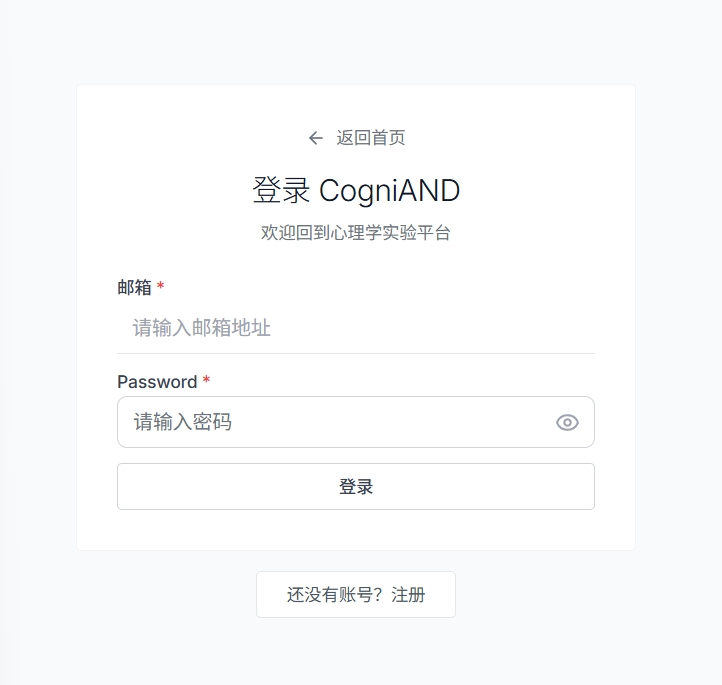
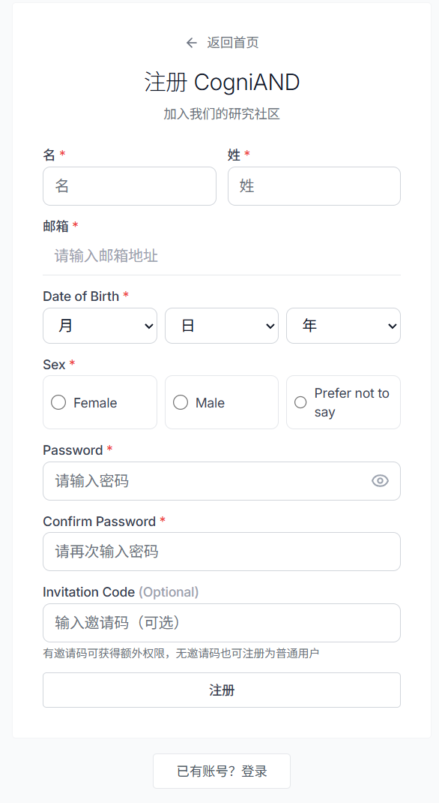
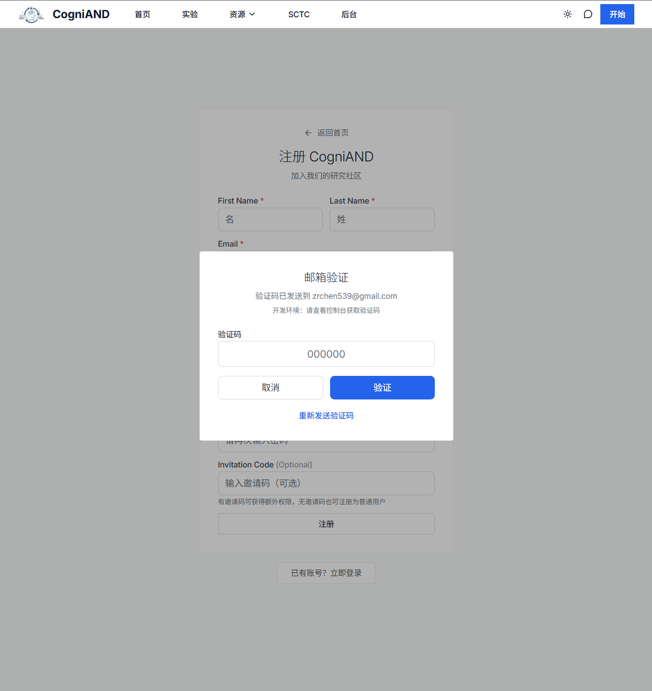
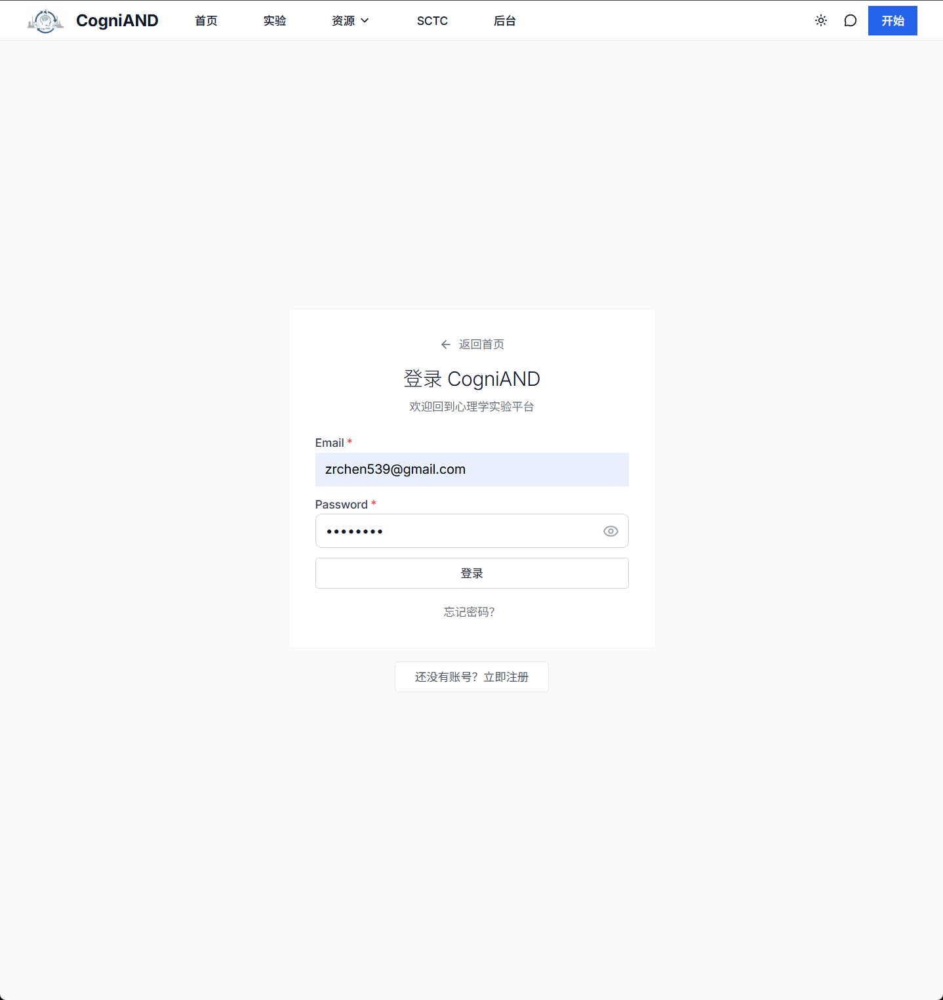
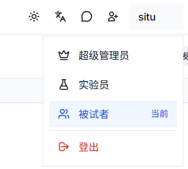
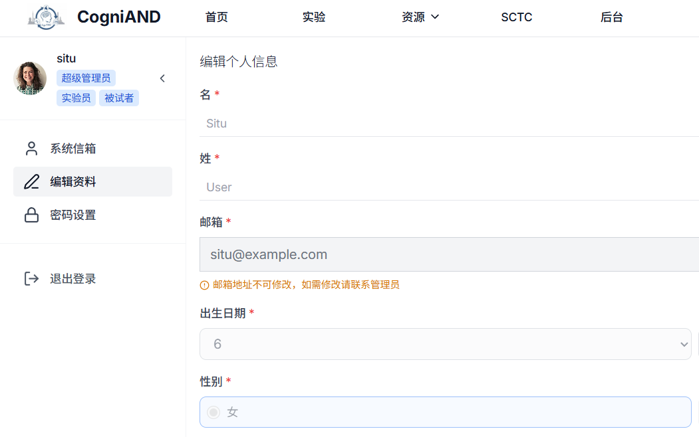

# 账户相关问题

## 注册与登录

### Q1: 如何注册/登录账号？

**A**: 点击页面右上角"开始"按钮，点击"*还没有账号？注册* "：

*图：CogniAND 注册/登录页面*

**需要填写的信息：**
- 邮箱地址（必填，用于登录）
- 密码（必填，至少8位）
- 姓名（firstName + lastName）
- 性别（male/female/prefer_not_to_say）
- 出生日期（年月日）

**邀请码（选填）：**
- 有邀请码可获得额外权限，无邀请码也可注册为普通用户

提交后系统会发送验证邮件，用户输入验证码进行验证。

详细步骤：[注册流程](/3-subject-manual/2-registration)

### Q2: 忘记密码怎么办？

**A**: 在登录页面点击"忘记密码"链接，输入注册邮箱，系统会发送密码重置邮件，输入邮件中的验证码进行密码重置。

**注意事项**：
- 重置链接有效期通常为24小时
- 重置链接只能使用一次
- 建议使用强密码（包含大小写字母、数字和特殊字符）

### Q3: 如何切换角色？

**A**: 登录后进入个人中心，在"角色管理"中选择要切换的角色即可。

**温馨提醒**：
- 注册时必须选择了多个角色
- 角色切换不会影响已有数据和权限

### Q4: 邮箱验证失败怎么办？

**A**: 请检查以下几点：
- 邮箱地址是否正确
- 验证码是否输入正确
- 如仍失败，点击"重新发送验证邮件"

**常见原因**：
1. 验证邮件在垃圾邮件文件夹
2. 邮箱地址输入错误

## 个人信息管理

### Q5: 如何修改个人信息？

**A**: 登录后进入个人中心，点击"编辑资料"，修改姓名、性别、出生日期等信息，点击"保存"即可。

**可修改的信息**：
- 姓名（firstName + lastName）
- 性别
- 出生日期
- 密码
- 邮箱（需要联系管理员）

### Q6: 如何删除账户？

**A**: 请联系平台管理员申请删除账户。

**重要提示**：
- 删除后，个人信息将被永久删除
- 已提交的实验数据可能因研究需要保留
- 删除操作不可撤销，请谨慎操作

联系方式：[技术支持](/7-technical-support/1-contact)

## 账户安全

### Q7: 如何保护账户安全？

**A**: 建议采取以下措施：

1. **使用强密码**
   - 至少8位字符
   - 包含大小写字母、数字和特殊字符
   - 不要使用常见密码（如123456、password等）

2. **定期更换密码**
   - 建议每3-6个月更换一次密码
   - 不要在多个网站使用相同密码

3. **保护邮箱安全**
   - 邮箱是账户恢复的重要途径
   - 确保邮箱密码安全

4. **注意登录环境**
   - 不要在公共电脑上保存密码
   - 使用完毕后及时退出登录

5. **警惕钓鱼邮件**
   - 平台不会通过邮件索要密码
   - 注意验证邮件发送者地址

### Q8: 账号被封禁怎么办？

**A**: 如果账号被封禁，请联系管理员了解原因并申请解封。

**可能的封禁原因**：
- 违反平台使用规则
- 提交虚假信息
- 恶意行为（如刷数据、骚扰其他用户等）
- 安全风险（如账号被盗用）

联系方式：[技术支持](/7-technical-support/1-contact)

