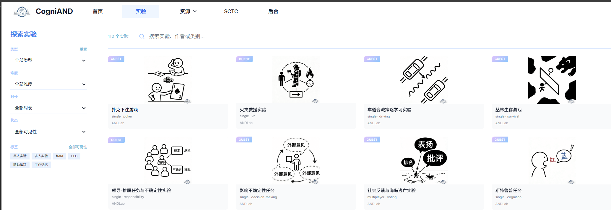
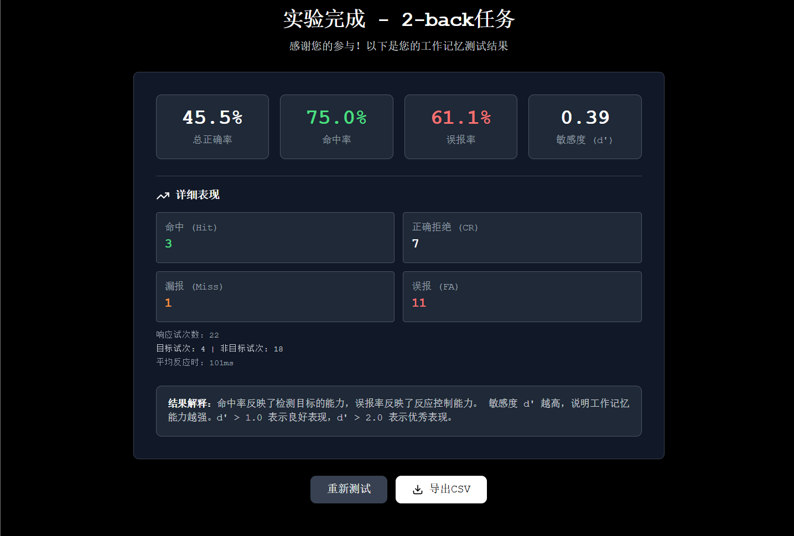
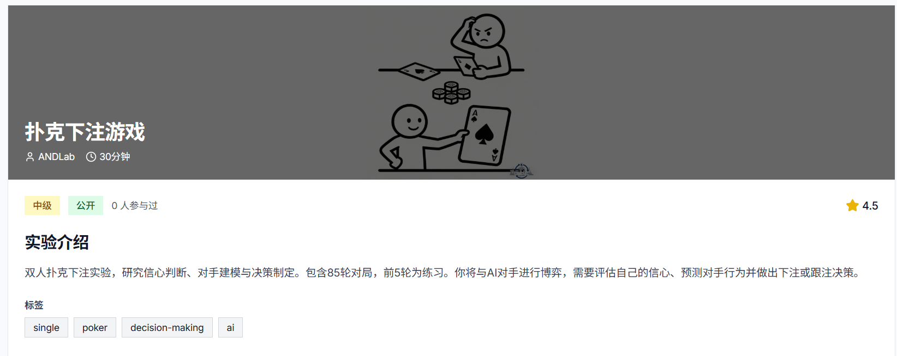
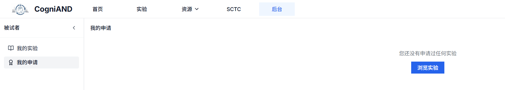
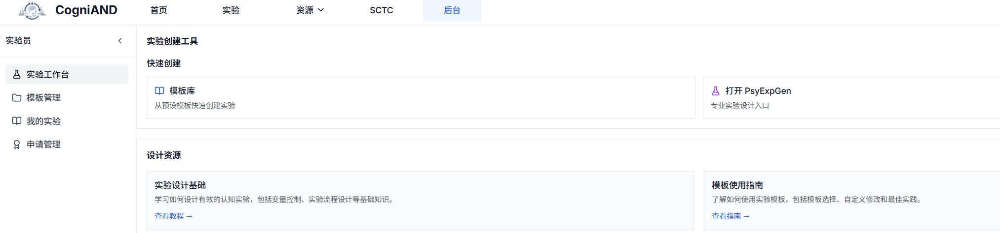

# 实验相关问题

## 被试相关

### Q7: 如何参与实验？

**A**: 在实验详情即可参与实验。

详细步骤：[被试手册 - 参与实验](../3-subject-manual/3-experiments.md)

### Q8: 实验数据如何获取？

**A**: 实验完成后，在实验结果详情页面点击导出按钮获取实验数据。

**支持的文件格式**：
- CSV
- JSON
- TXT

### Q12: 实验评分有什么作用？

**A**: 被试对实验的评分可以帮助其他被试了解实验质量，也可以帮助主试改进实验设计。

**评分范围**：1-5星
- 5星：非常满意
- 4星：满意
- 3星：一般
- 2星：不满意
- 1星：非常不满意

**评分内容**：
- 实验设计合理性
- 实验说明清晰度
- 实验时长准确性
- 整体体验

### Q13: 如何收藏实验？

**A**:

点击实验详情页的"收藏"按钮可收藏实验。

### Q14: 实验报名需要审核吗？

**A**: 根据实验设置，部分实验需要主试审核，部分实验可自动通过。

**审核流程**：
1. 提交报名申请
2. 主试查看申请
3. 主试审核（通过/拒绝）
4. 被试收到通知
5. 开始实验

## 主试相关

### Q9: 如何创建实验？

**A**: ❌ **当前实验创建功能尚未完全实现**。

前端有完整的实验创建界面，但后端缺少对应的API实现，暂时无法保存和发布新实验。

**前端界面包含**：
- 实验基本信息设置
- 实验范式配置
- 招募条件设置
- 知情同意书编辑

详细说明：[主试手册 - 创建实验](/2-experimenter-manual/3-experiment-management/3-2-create-experiment)

### Q10: 实验数据如何导出？

**计划支持的导出格式**：
- CSV（Excel可打开）
- JSON（程序处理）
- SPSS格式
- 自定义格式

详细说明：[主试手册 - 数据管理](/2-experimenter-manual/6-data-management)

### Q11: 如何邀请被试参与实验？

**A**: 登录主试账号，进入"邀请管理"页面，点击"生成邀请链接"，复制链接发送给被试，或使用"发送邮件"功能批量邀请。

**邀请方式**：
1. **邮件邀请**：输入被试邮箱，系统自动发送邀请邮件
2. **链接分享**：复制邀请链接，通过社交媒体分享
3. **二维码分享**：生成二维码，打印或展示

详细步骤：[主试手册 - 邀请系统](/2-experimenter-manual/5-invite-system/)

## 实验范式

### Q15: 平台支持哪些实验范式？

**A**: CogniAND平台支持多种心理学实验范式，涵盖：

**认知实验范式**：
- Stroop色词干扰任务
- N-back工作记忆任务
- Eriksen侧抑制任务
- 任务切换
- 信号检测任务
- 等

**情绪实验范式**：
- 眼神读心测试（RMET）
- 共情测试
- 疼痛共情
- 敬畏情绪
- 等

**社会认知实验范式**：
- Asch从众实验
- 道德判断
- 社会排斥
- 文化归因
- 等

**决策与博弈实验范式**：
- 独裁者博弈
- 信任博弈
- 最后通牒博弈
- 囚徒困境
- 公共物品博弈
- 等

完整列表请查看：[平台信息 - 实验范式库](/4-platform-info/1-about)

### Q16: 如何使用实验模板？

**A**: 登录主试账号，访问"模板库"页面，浏览可用的实验模板，选择合适的模板，点击"使用模板"进行定制。

**模板库功能**：
- 浏览所有可用模板
- 按类别筛选模板
- 预览模板效果
- 基于模板创建实验

详细说明：[主试手册 - 模板库使用](/2-experimenter-manual/4-template-library)

**还有其他实验相关问题？** 请查看：
- [主试手册](/2-experimenter-manual/)
- [被试手册](/3-subject-manual/)
- [技术支持](/7-technical-support/1-contact)
