## 快速上手流程

欢迎使用 CogniAND 心理学认知实验平台！作为主试（实验研究者），您可以在平台上创建、发布和管理心理学实验，招募被试参与，并收集分析实验数据。

### 第一步：注册账户
1. 访问平台首页，点击"注册"
2. 填写用户名、邮箱和密码
3. 选择"主试"角色（可同时选择多个角色）
4. 验证邮箱完成注册

### 第二步：编辑个人资料
登录后，可在个人中心编辑资料：
- 姓名

- 出生日期

- 性别

- 如需修改邮箱地址请联系管理员

### 第三步：创建第一个实验

**选择创建方式：**

**方式一：使用模板库**
1. 进入"实验工作台"
2. 点击"模板库"
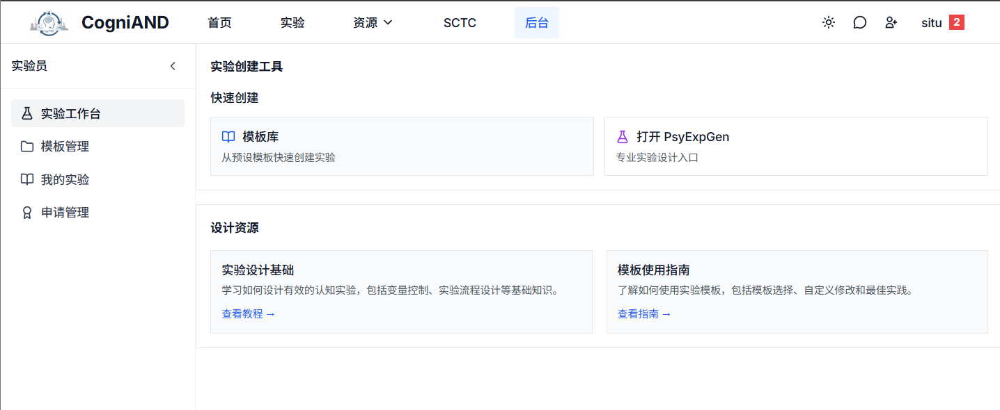

3. 浏览并选择合适的实验模板，也可以使用检索功能进行模板筛选

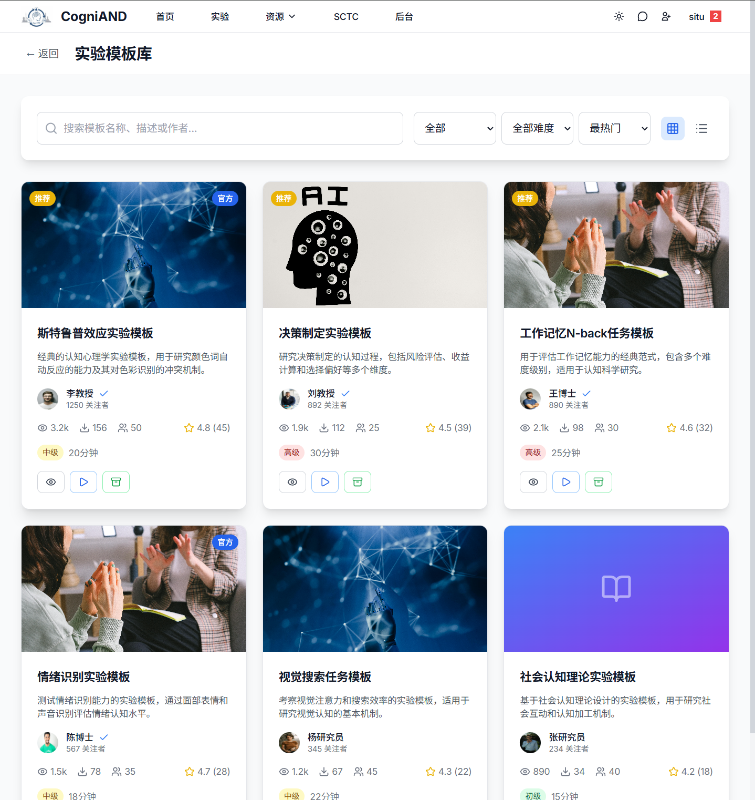
4. 根据需要修改实验参数
5. 保存并提交审核

**方式二：使用 PsyExpGen 工具**
1. 点击"使用 PsyExpGen"。
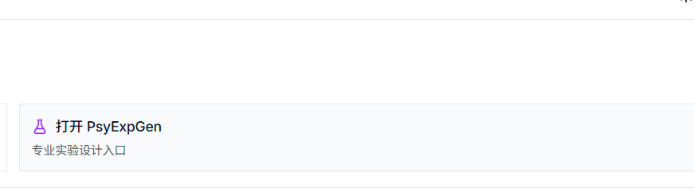
2. 在专业工具中设计实验。
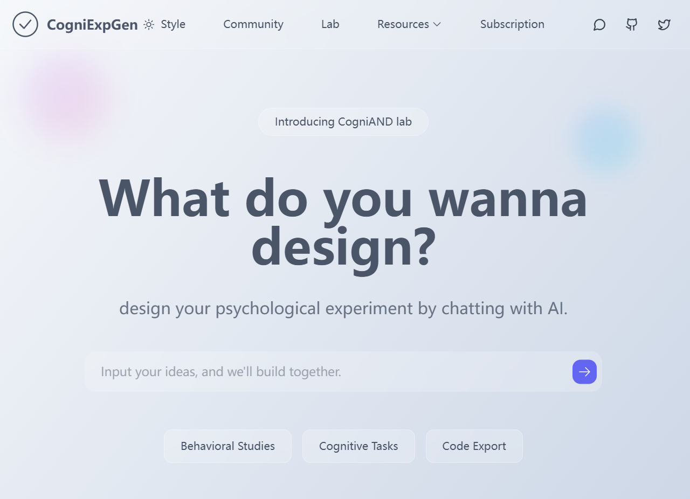
3. 填写实验信息。
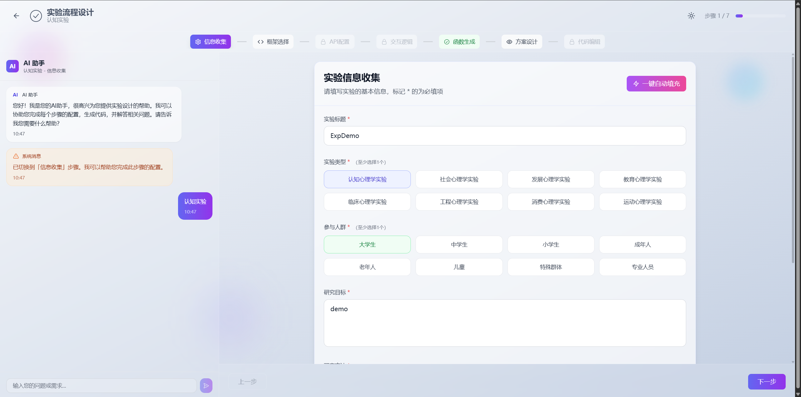
4. 选择实验框架。
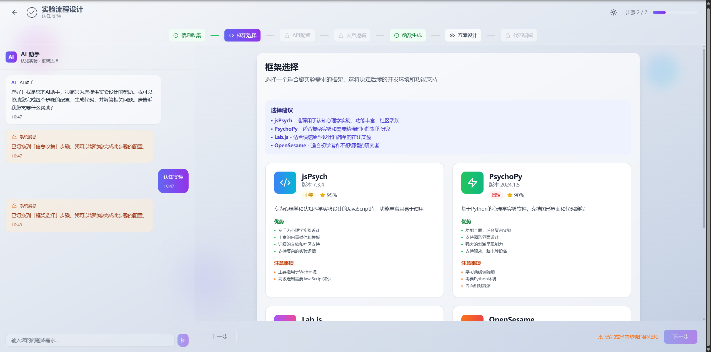
5. 填写配置，选择您想使用的api。
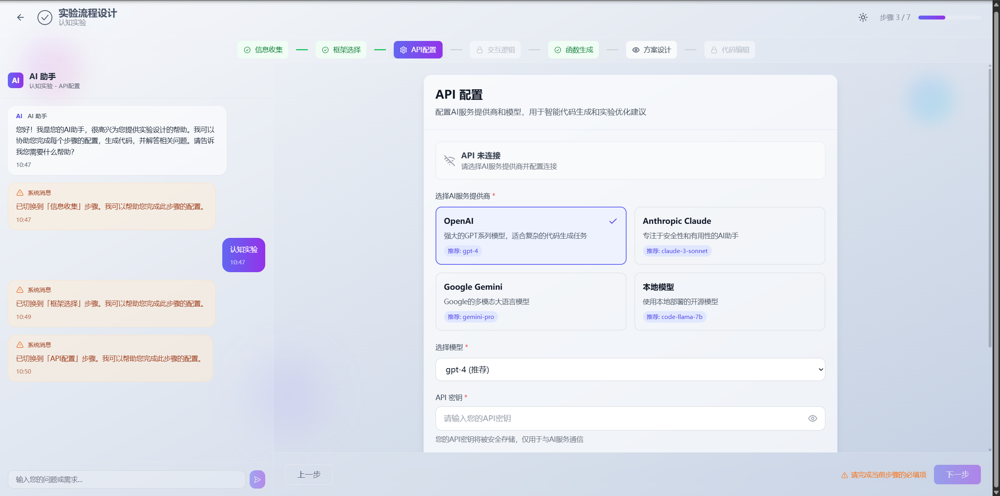
6. 填写试验方案设计提示词。
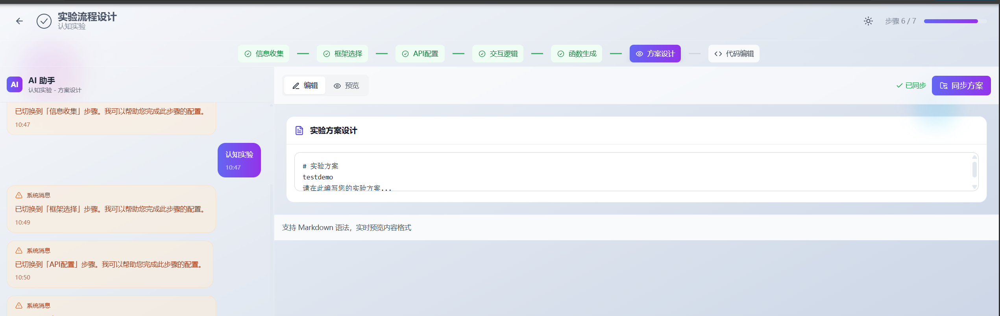
7. 代码编辑并且完成实验生成
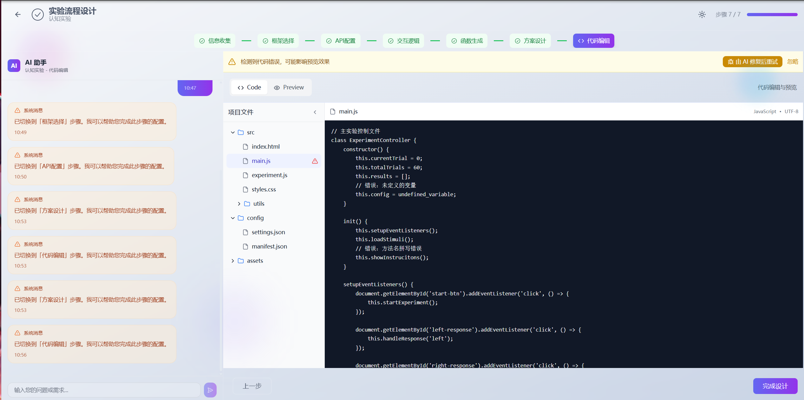

::: tip 提示
您可以使用左侧的AI助手对话框来辅助设计实验
:::
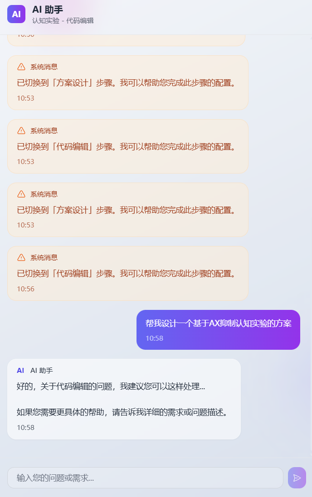
### 第四步：等待审核
- 提交后，实验会进入"待审核"状态
- 管理员会审查实验内容和设置
- 通常在 1-3 个工作日内完成审核
- 您会收到审核结果通知

::: warning 注意
如果实验被拒绝，请查看管理员的反馈意见，修改后重新提交。
:::

### 第五步：激活实验
审核通过后：
1. 在"我的实验"中找到已批准的实验
2. 点击"激活"开始招募被试
3. 实验会出现在平台的实验目录中
4. 被试可以看到并申请参与

### 第六步：管理参与者
当有被试申请参与时：
1. 在"参与者管理"中查看申请列表
2. 查看申请者的基本信息
3. 决定批准或拒绝申请
4. 批准后，被试可以开始实验
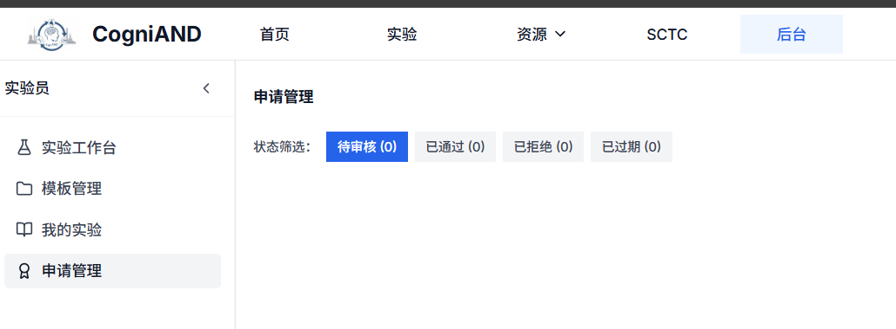

::: tip
申请会在 -- 天后自动过期，请及时处理。
:::
## 管理实验和模板
1. 在后台界面的”我的界面“和”模板管理“查看
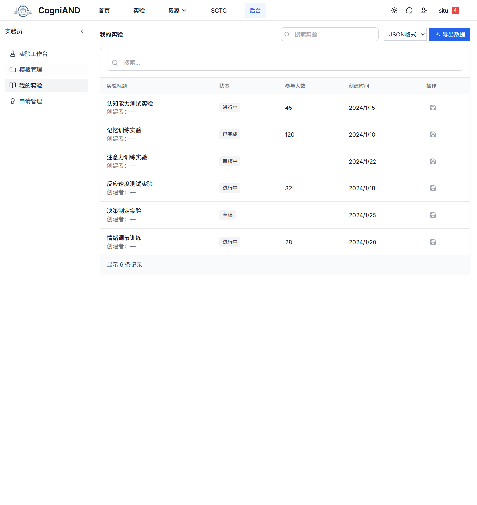
## 信息发送
1. 在后台“系统信箱”界面可以查看信息，已经被屏蔽的账户，已发送邮件等内容。

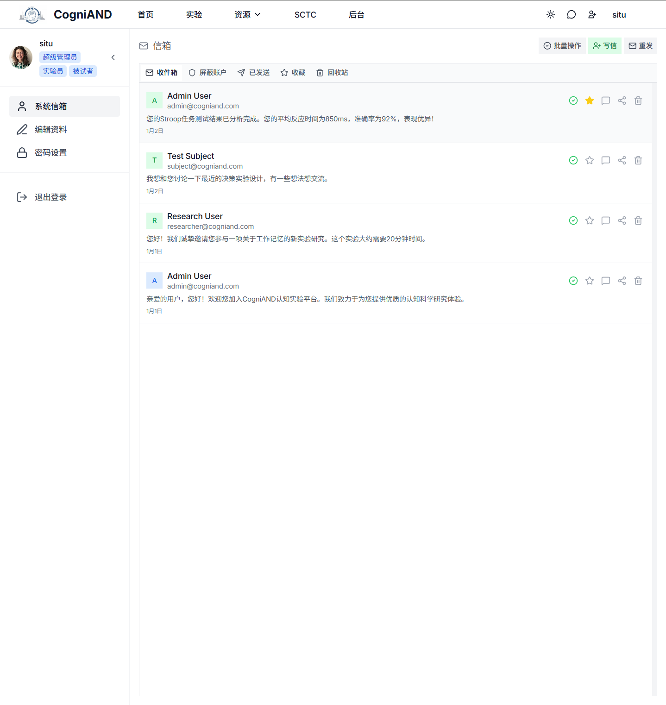
2. 您可以点击信息卡片查看完整内容
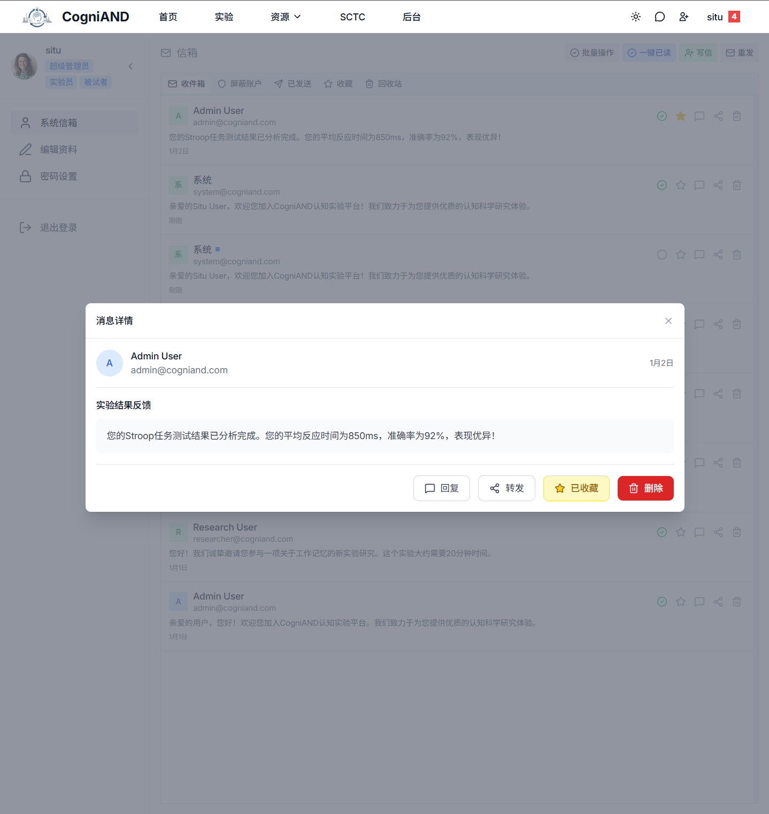

3. 点击“写信”按钮，可以编辑信息内容。
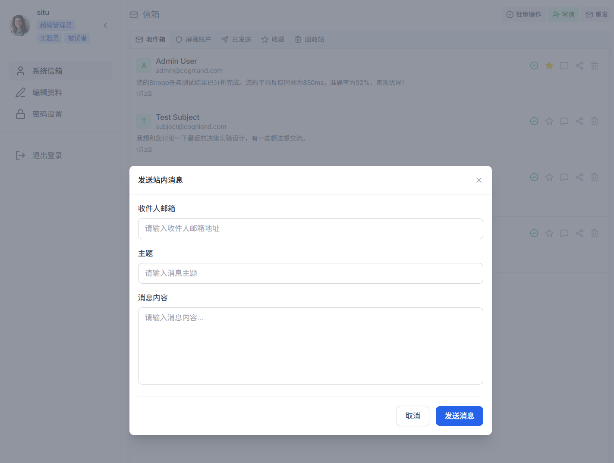
## 实验状态说明

您的实验会经历以下状态：

| 状态 | 说明 | 可执行操作 |
|------|------|-----------|
| **草稿** | 正在编辑中 | 修改、删除、提交审核 |
| **待审核** | 等待管理员审核 | 撤回、查看进度 |
| **已批准** | 审核通过 | 激活、修改部分信息 |
| **进行中** | 正在招募被试 | 管理参与者、暂停、结束 |
| **已暂停** | 临时停止招募 | 重新激活、结束 |
| **已完成** | 实验结束 | 查看数据、导出、保存为模板 |
| **已拒绝** | 审核未通过 | 查看反馈、修改、重新提交 |

## 常见问题

### 我可以创建多少个实验？
平台对实验数量没有限制，但建议合理规划，确保每个实验都能得到充分的管理和数据收集。

### 实验审核需要多长时间？
通常在 1-3 个工作日内完成。如果超过 3 天未收到反馈，可以联系技术支持。

### 可以修改已激活的实验吗？
已激活的实验只能修改部分非核心信息（如描述、封面图）。如需修改核心内容，建议暂停实验，创建新版本。

---

**需要帮助？** 查看[常见问题](/1-FAQ/)或联系[技术支持](/7-technical-support/1-contact)。
