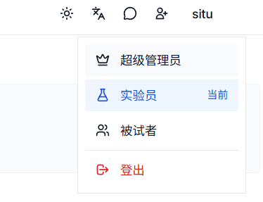

# 主试注册与登录

本页面详细介绍主试如何注册账户、登录平台以及相关的账户管理功能。

## 注册账户

### 访问注册页面

1. 打开 CogniAND 平台首页
2. 点击页面右上角的"注册"按钮
3. 进入注册页面

### 填写注册信息

注册表单包含以下必填项：

#### 基本信息
- **用户名**
  - 用于登录和在平台上显示
  - 3-20 个字符
  - 支持中文、英文、数字和下划线
  - 用户名一旦注册不可修改

- **邮箱地址**
  - 用于接收验证邮件和重要通知
  - 必须是有效的邮箱地址
  - 一个邮箱只能注册一个账户
  - 建议使用常用邮箱，确保能及时收到通知

- **密码**
  - 至少 8 个字符
  - 建议包含大小写字母、数字和特殊字符
  - 不要使用过于简单的密码（如 123456）
  - 不要使用与用户名相同的密码

- **确认密码**
  - 再次输入密码以确认
  - 必须与上面输入的密码完全一致

  

## 登录平台

### 登录方式

CogniAND 平台支持以下登录方式：

#### 用户名/邮箱 + 密码登录

1. 访问平台首页
2. 点击"登录"按钮
3. 输入用户名或邮箱
4. 输入密码
5. 点击"登录"

**可选功能：**
- **记住我**：勾选后，下次访问时自动填充用户名
- **自动登录**：勾选后，7 天内无需重复登录（不建议在公共电脑上使用）

## 密码管理

### 修改密码

**密码要求：**
- 至少 8 个字符
- 建议包含大小写字母、数字和特殊字符
- 不能与最近 3 次使用的密码相同
- 不能与用户名相同

## 账户安全

### 安全建议

为了保护您的账户安全，建议：

1. **使用强密码**
   - 包含大小写字母、数字和特殊字符
   - 不要使用生日、电话号码等容易被猜到的信息
   - 定期更换密码（建议 3-6 个月更换一次）

2. **保护登录信息**
   - 不要与他人共享账户
   - 不要在公共电脑上保存密码
   - 使用后及时退出登录

3. **警惕钓鱼邮件**
   - 平台不会通过邮件索要密码
   - 注意识别伪造的登录页面
   - 只在官方网站登录

4. **定期检查登录记录**
   - 在"账户安全"中查看最近的登录记录
   - 如发现异常登录，立即修改密码

## 退出登录

### 如何退出

1. 点击右上角头像
2. 在下拉菜单中选择"退出登录"
3. 确认退出

::: tip 提示
如果勾选了"自动登录"，退出后仍会保留登录状态。如需完全退出，请在退出前取消勾选"自动登录"。
:::

## 多设备登录

### 支持情况

- 平台支持在多个设备上同时登录
- 同一账户可以在电脑、平板、手机上使用
- 数据会在所有设备间同步

### 安全提示

- 定期检查登录设备列表
- 如发现未知设备，立即修改密码
- 不建议在不信任的设备上登录

## 下一步

完成注册和登录后，您可以：

- 📖 返回[快速开始](./1-getting-started)了解主试功能概览
- 🔬 学习如何[创建实验](./3-experiment-management/3-2-create-experiment)
- 📚 探索[模板库](./4-template-library)快速开始
- 👤 完善[个人资料](./7-backstage)提升专业形象

---

**遇到问题？** 查看[常见问题](/1-FAQ/1-account)或联系[技术支持](/7-technical-support/1-contact)。
