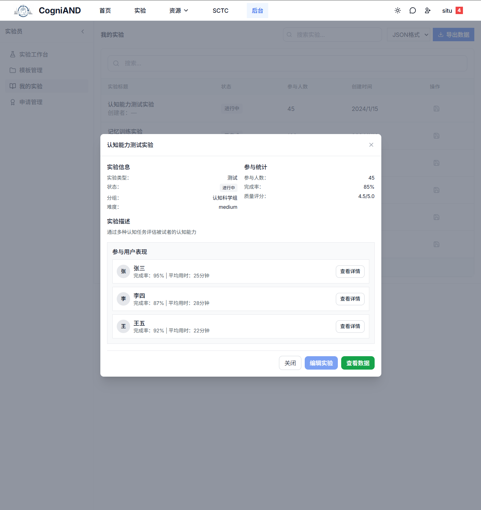

# 数据管理

## 概述

数据管理功能帮助您查看、导出和分析实验数据。系统自动收集被试的实验数据，您可以随时导出进行分析。

## 主要功能

### 1. 查看实验数据

**数据来源**：
- 被试完成实验后自动上传
- 包含实验结果、反应时、准确率等
- 记录实验过程中的所有交互

**查看方式**：
- 在实验者后台的"我的实验"中选择实验
- 查看实验数据统计
- 查看单个被试的详细数据

## 常见问题

### Q1: 数据什么时候可以导出？
**A**: 被试完成实验后数据立即可用，可随时导出。

### Q2: 导出的数据包含被试个人信息吗？
**A**: 不包含，数据已匿名化处理，使用唯一ID标识被试。

### Q3: 可以导出部分数据吗？
**A**: 可以，在导出时可以选择时间范围或特定被试的数据。

### Q4: 数据会保存多久？
**A**: 数据长期保存，但建议及时导出备份。

### Q5: 如何确保数据质量？
**A**: 系统自动进行基本质量检查，建议导出后进行进一步的数据清洗和质量控制。

---

**需要更多帮助？** 请查看：
- [实验者后台](/2-experimenter-manual/7-backstage)
- [数据与隐私](/5-data-privacy/)
- [技术支持](/7-technical-support/1-contact)
