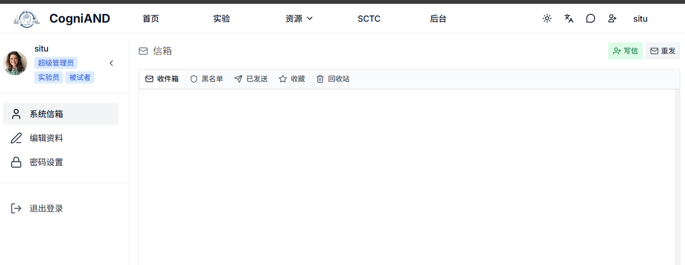

# 被试快速开始

欢迎使用 CogniAND 心理学认知实验平台！作为被试，您可以参与各类心理学实验，为科学研究贡献数据。

## 被试能做什么？

- 浏览平台上的实验目录
- 申请参与感兴趣的实验
- 完成实验任务
- 查看实验结果和反馈
- 管理实验参与记录
- 导出实验日程到日历

## 快速上手流程

### 1. 注册账户
访问平台首页，点击"注册"，填写基本信息并选择"被试"角色。

详细步骤请查看：[注册流程](./2-registration)

### 2. 浏览实验
登录后，在"实验目录"中浏览可参与的实验，查看实验详情。

### 3. 申请参与
找到感兴趣的实验后，点击"申请参与"，等待主试审批。

### 4. 参与实验
申请获批后，按时参与实验，认真完成任务。

### 5. 查看结果
实验完成后，在"收件箱"查看反馈和成绩。

详细参与流程请查看：[实验参与](./3-experiments)

## 实验类型

平台提供多种类型的实验：
- **认知实验**：反应时间、记忆任务、注意力测试等
- **博弈论实验**：决策任务、社会互动实验等
- **问卷调查**：心理量表、态度调查等
- **模拟实验**：情境模拟、行为观察等

## 注意事项

- 认真阅读知情同意书和实验说明
- 在安静的环境中完成实验
- 如实填写信息，认真完成任务
- 遇到问题及时联系主试或技术支持

---

**下一步：** [注册流程](./2-registration) | [实验参与](./3-experiments)
