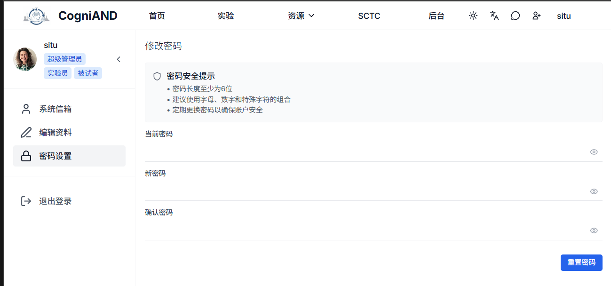

# 注册流程

## 注册步骤

### 1. 访问注册页面
打开平台首页，点击右上角"注册"按钮。

### 2. 填写注册信息

**必填信息：**
- 用户名：唯一的用户标识
- 邮箱地址：用于登录和接收通知
- 密码：建议8位以上，包含大小写字母、数字和特殊字符
- 确认密码：再次输入密码确认

### 3. 提交注册
确认信息无误后，点击"开始"按钮。

### 4. 邮箱验证
系统会发送验证邮件到您的邮箱，点击邮件中的验证链接完成账户激活。

## 登录平台

### 登录方式
- 使用注册的用户名或邮箱和密码登录
- 支持"记住我"功能，方便下次快速登录

### 登录选项
- **记住我**：下次访问自动填充用户名
- **自动登录**：7天内无需重复登录（不建议在公共电脑使用）

## 密码管理

### 修改密码
登录后，在个人中心可以修改密码：
1. 点击右上角账户名称
2. 点击"账户安全"
3. 选择"修改密码"
4. 输入当前密码和新密码
5. 提交修改

::: tip 建议
- 每个邮箱只能注册一个账户
- 用户名一旦注册不可修改
- 请填写写真实信息，有助于实验数据准确性
- 密码请妥善保管，不要与他人共享
- 注册后必须完成邮箱验证才能使用
- 建议定期更换密码（3-6个月）
:::
## 常见问题

**Q: 邮箱已被注册怎么办？**
A: 使用其他邮箱注册，或直接登录该账户。

**Q: 未收到验证邮件？**
A: 检查垃圾邮件文件夹，或点击"重新发送验证邮件"。

**Q: 可以同时是被试和主试吗？**
A: 可以，注册时可以选择多个角色，后续也可以在个人设置中添加角色。

**Q: 忘记用户名怎么办？**
A: 可以使用邮箱登录，或联系技术支持找回。

---

**相关页面：** [快速开始](./1-getting-started) | [实验参与](./3-experiments)
