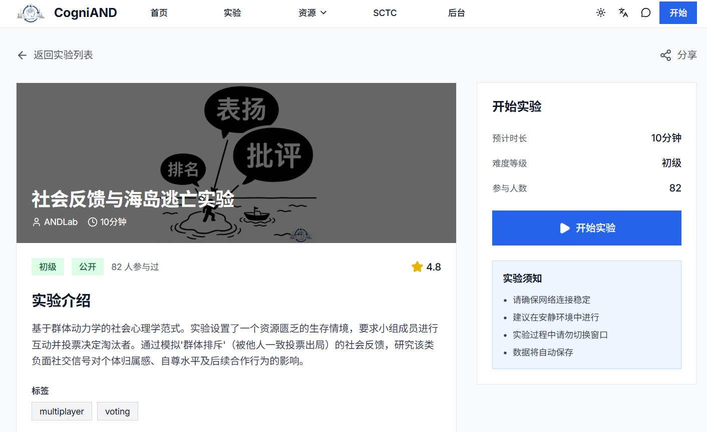
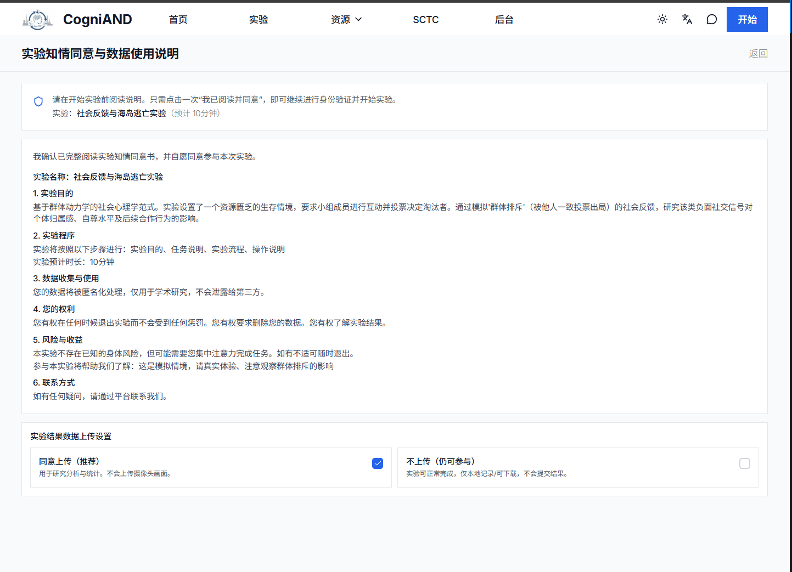
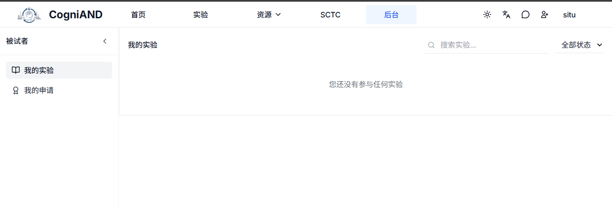
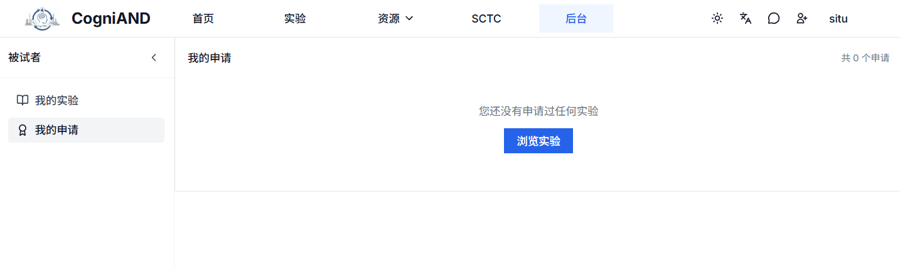

# 实验参与

本页面介绍如何参与实验的完整流程，包括浏览、申请、参与和管理实验。

## 浏览实验

### 查看实验列表
登录后，在以下位置可以查看实验：
- 平台首页的"实验目录"
- 顶部导航栏的"实验"菜单

### 搜索和筛选
- **搜索**：输入关键词搜索实验标题或描述
- **筛选**：按类别、难度、时长筛选实验
- **排序**：按最新发布、参与人数等排序

### 实验信息
每个实验显示：
- 实验标题和封面图
- 实验类别（认知、博弈论、问卷等）
- 难度等级（简单/中等/困难）
- 预计时长（分钟）
- 参与人数和主试信息

### 查看详情
点击实验卡片查看完整信息：
- 实验说明和流程
- 参与要求（年龄、性别等）
- 知情同意书
- 报酬说明（如有）

## 申请实验

### 申请步骤
1. 在实验详情页点击"申请参与"
2. 填写申请说明（如主试要求）
3. 提交申请
4. 等待主试审批

### 申请状态
- **审核中**：等待主试审批
- **已通过**：可以参与实验
- **已拒绝**：查看拒绝原因，可重新申请

### 申请管理
在"被试后台" → "我的申请"中可以：
- 查看所有申请记录
- 撤销审核中的申请
- 重新申请被拒绝的实验
- 查看审核备注

## 实验完成后

### 查看结果
实验完成后，在"收件箱"查看：
- 实验成绩
- 主试反馈
- 参与证书（如有）

### 评价实验
可以对实验进行评价：
- 实验体验评分
- 文字反馈
- 帮助改进实验设计

### 重复参与
如果主试允许，可以申请重复参与：
1. 在"实验历史"中找到已完成的实验
2. 点击"申请重复"
3. 填写重复理由
4. 等待审批

::: tip 建议

- 定期检查待参与实验，避免错过
- 使用日历导出功能管理实验日程
- 及时完成进行中的实验
- 关注申请状态和审核反馈
- 认真阅读知情同意书
- 遇到问题及时沟通
:::
## 常见问题

**Q: 申请一直是"审核中"状态？**
A: 主试需要时间审核，请耐心等待。审核结果会通过消息通知。

**Q: 申请被拒绝后可以重新申请吗？**
A: 可以，建议根据拒绝原因调整后重新提交。

**Q: 如何导出实验日程？**
A: 在"我的实验"中点击"导出日历"，下载 .ics 文件后导入日历应用。

**Q: 可以同时参与多个实验吗？**
A: 可以，建议合理安排时间，使用日历功能管理日程。

**Q: 实验进度会保存吗？**
A: 会，实验进度会自动保存，可以随时继续。

---

**相关页面：** [快速开始](./1-getting-started) | [注册流程](./2-registration)
