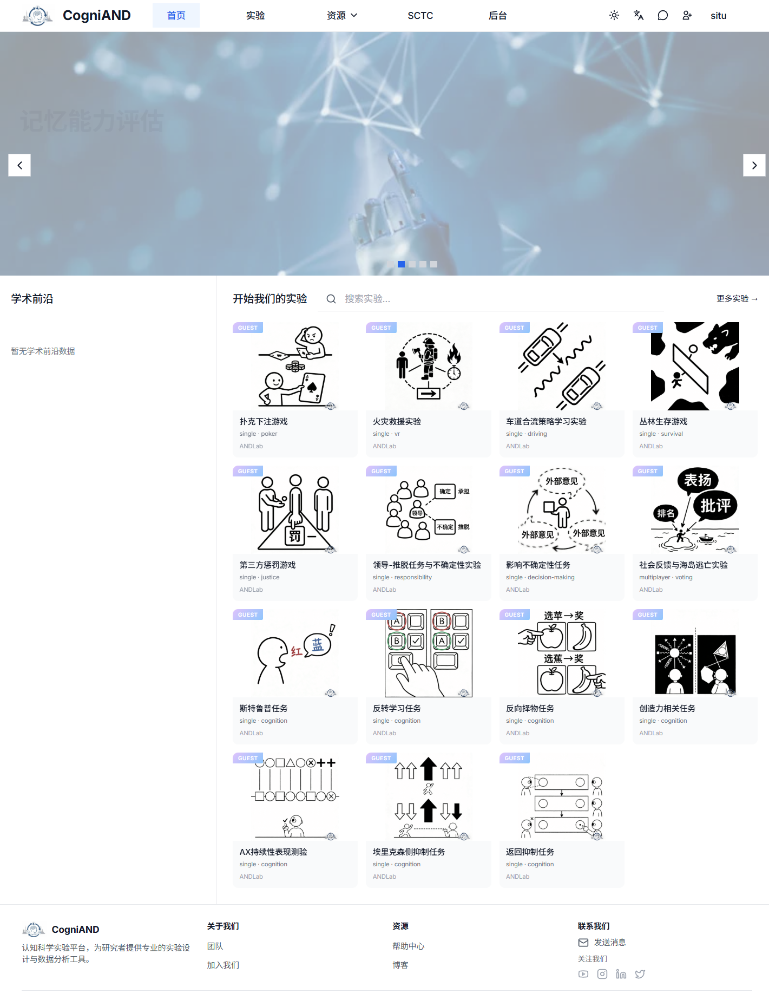
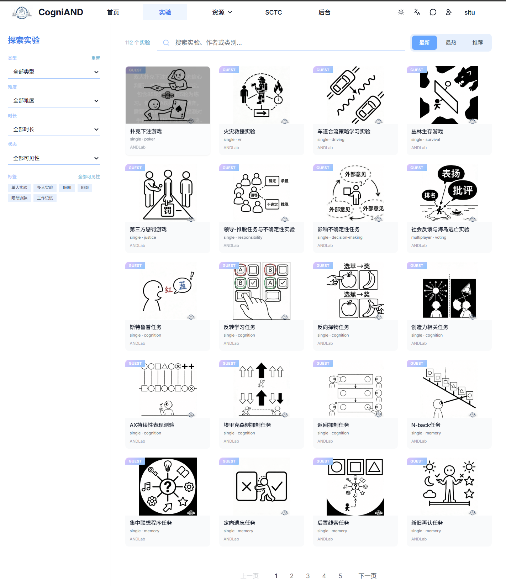

# 被试手册

欢迎使用CogniAND心理学实验平台！本手册将帮助您了解如何作为被试（实验参与者）使用平台的各项功能。

## 什么是被试？

被试是实验的参与者，可以浏览、报名并参与各类心理学实验。在CogniAND平台上，被试可以：

- ✅ 浏览所有公开实验
- ✅ 搜索和筛选感兴趣的实验
- ✅ 查看实验详情和评价
- ✅ 上传实验数据
- ✅ 对实验进行评分
- ✅ 管理个人资料
- ✅ 报名参与实验
- ✅ 查看参与历史

## 快速导航

### 入门指南
- [快速开始](./1-getting-started) - 5分钟了解被试功能
- [注册与登录](./2-registration-login/) - 创建被试账号

### 核心功能
- [浏览实验](./3-browse-experiments/) - 查找感兴趣的实验
- [参与实验](./4-participate-experiment/) - 完整的实验参与流程
- [个人中心](./5-personal-center) - 管理个人信息
- [被试后台](./6-backstage) - 查看参与历史

### 重要信息
- [权限说明](./7-permissions) - 了解被试的权限边界和注意事项

## 权限说明

### 被试权限

- ✅ 浏览所有公开实验
- ✅ 搜索和筛选实验
- ✅ 查看实验详情
- ✅ 上传实验数据
- ✅ 对实验进行评分
- ✅ 管理个人资料
- ✅ 切换角色
- ✅ 报名参与实验
- ✅ 查看参与历史

- ❌ 查看其他被试的个人信息
- ❌ 修改已提交的实验数据
- ❌ 创建或编辑实验
- ❌ 查看未公开的实验
- ❌ 访问主试或管理员功能

## 实验类型

CogniAND平台支持多种类型的心理学实验：

### 认知实验
- Stroop色词干扰任务
- N-back工作记忆任务
- 任务切换
- 信号检测任务
- 等

### 情绪实验
- 眼神读心测试（RMET）
- 共情测试
- 疼痛共情
- 敬畏情绪
- 等

### 社会认知实验
- Asch从众实验
- 道德判断
- 社会排斥
- 文化归因
- 等

### 决策与博弈实验
- 独裁者博弈
- 信任博弈
- 最后通牒博弈
- 囚徒困境
- 公共物品博弈
- 等

完整列表请查看：[平台信息 - 实验范式库](/4-platform-info/1-about)

## 需要帮助？

- 查看[常见问题 FAQ](/1-FAQ/)
- 查看[故障排除](/6-troubleshooting/)
- 联系[技术支持](/7-technical-support/1-contact)

---

**准备好开始了吗？** 查看[快速开始](./1-getting-started)开始您的第一个实验！
